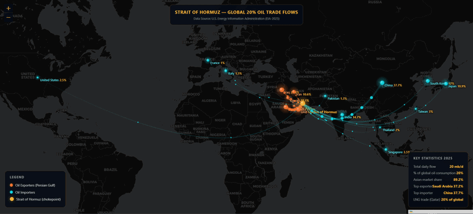

## 🎥 Demo



#  Strait of Hormuz — Global Oil Trade Flows

An interactive, animated web map visualizing the flow of crude oil through the **Strait of Hormuz**, the world's most critical energy chokepoint. Built with [Leaflet.js](https://leafletjs.com/) and HTML5 Canvas.

> **Data Source:** U.S. Energy Information Administration (EIA), 2025

## 📸 Overview

The map shows animated flow lines from **6 Persian Gulf exporters** through the Strait of Hormuz to **11 global importers**, with particle animations scaled by volume (mb/d). All markers and flows are interactive with hover tooltips.


## 📁 File Structure

```
├── index.html          # Main HTML entry point
├── map.js              # Leaflet map, canvas animation, markers & tooltips
├── import_export.js    # Data: exporters, importers, flow coordinates
└── style.css           # Dark-theme UI styles (panels, tooltip, canvas)
```


## 🗂️ Data (`import_export.js`)

### Exporters (Persian Gulf)
| Country | mb/d | % of Strait Flow |
### Top Importers
| Country | mb/d | % of Strait Flow |

Each entry includes:
- `lat` / `lng` — geographic coordinates
- `mbpd` — million barrels per day
- `share` — percentage of total Strait flow
- `ctrl` — Bezier curve control point offsets for animated arc routing


## 🗺️ Map Features (`map.js`)

### Animated Flow Lines
Quadratic Bezier arcs drawn on an HTML5 Canvas overlay, with:
- **Line width** scaled by `mbpd` relative to `MAX_MBPD`
- **Particle count & speed** also scaled by volume
- **Color coding** — orange `#ff7b2c` for exporters, cyan `#00c5e8` for importers
- Smooth 60fps render loop via `requestAnimationFrame`

### Glowing Dot Markers
- Pulsing radial gradient glow effect
- Radius proportional to flow volume
- Gold `#ffb432` for the Strait chokepoint itself

### Labels
Leaflet `divIcon` labels with country name + share percentage, styled with text-shadow for readability over the dark basemap.

### Tooltips
Custom HTML tooltip showing:
- Country name & role (exporter / importer)
- Volume in mb/d and percentage of Strait flow
- Smart left/right repositioning to stay within viewport


## 🎨 Styling (`style.css`)

- **Dark navy** base (`#060d1a`) with CARTO Dark basemap
- **Gold** (`#ffb432`) accent color for headings, values, and borders
- Three floating `.panel` elements: title bar (top-center), legend (bottom-left), stats (bottom-right)
- Backdrop blur glass-morphism panels


## 🛠️ Dependencies

| Library | Version | Purpose |
| [Leaflet.js](https://leafletjs.com/) | 1.9.4 | Interactive map base |
| [CARTO Dark Matter](https://carto.com/basemaps/) | — | Dark tile basemap |

